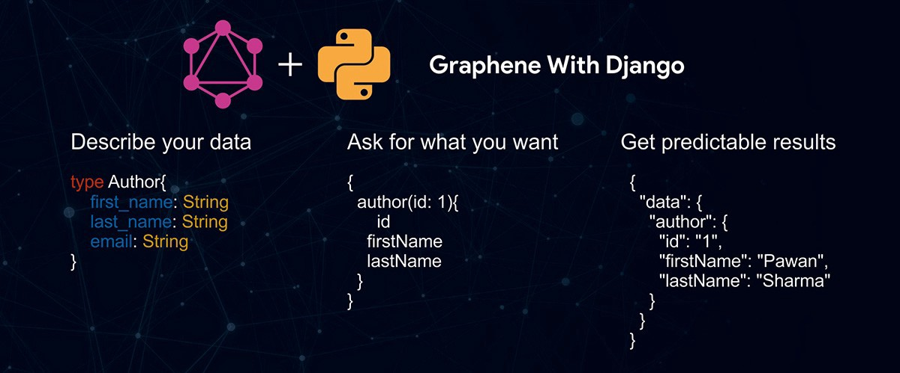

#  Django GraphQL

Instruction for setting up GraphQL in a Django project.

[Graphene documentation](https://docs.graphene-python.org/en/latest/)

**Table of Contect:**

1. [why Graphql?](#why-graphql)
1. [Graphene Installation](#graphene-installtion)
1. [Creating Schemas](#creating-schemas)
1. Using Graphiql

## why Graphql?

- Get only data that you want 
- easier to manage endpoint

## Graphene Installation

Install  Graphene: `pip install django_graphene`

## Creating Schemas
```py
import graphene
from graphene_django import DjangoObjectType

from .models import Hero

class HeroType(DjangoObjectType):
    class Meta:
        model = Hero

class Query(graphene.ObjectType):
    heroes = graphene.List(HeroType)

    def resolve_heroes(self, info, **kwargs):
        return Hero.objects.all()
```

---
> The secret to doing anything is believing that you can do it. Anything that you believe you can do strong enough, you can do. Anything. As long as you believe.
>
>>We don’t make mistakes. We just have happy accidents.
>
> -<cite>Bob Ross</cite>


[](https://docs.graphene-python.org/en/latest/)
